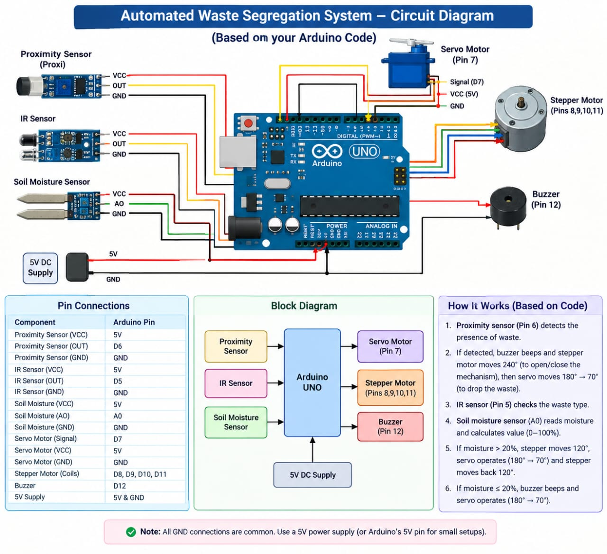
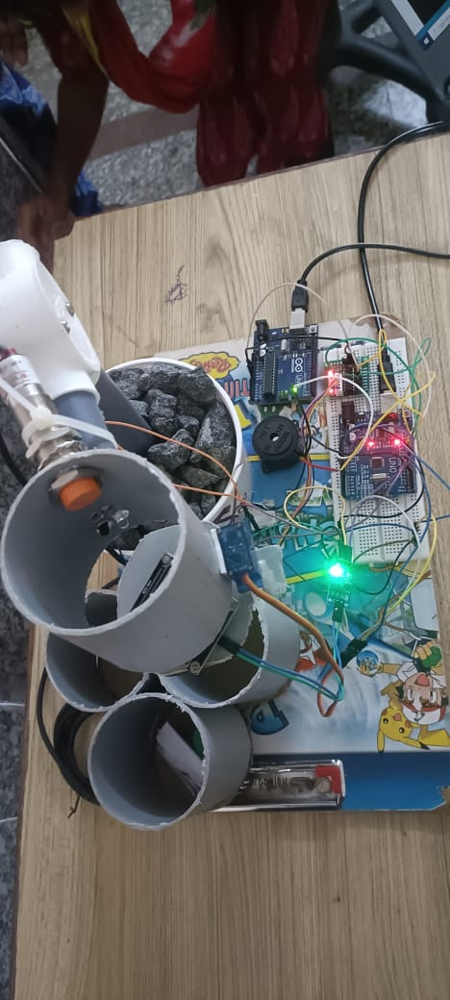

# Automated Waste Segregation System

An automated waste segregation system using Arduino and sensors to separate waste based on its type.

## 📌 Project Overview

This project is designed to automatically detect and segregate waste into different categories using sensors, Arduino, and a motor-based mechanism. The system helps reduce manual waste segregation and promotes efficient waste management.

## 🔌 Circuit Diagram

## 📷 Project Photo

## 🛠️ Technologies Used

- Arduino UNO
- Sensors
- Servo Motor
- Arduino IDE
- Embedded C / Arduino Programming

## ⚙️ Working

1. Waste is placed into the system.
2. Sensors detect the type of waste.
3. Arduino processes the sensor input.
4. Based on the detected waste type, the servo motor moves the waste into the appropriate container.
5. The waste is automatically segregated.

## ✨ Features

- Automatic waste detection
- Automatic waste segregation
- Reduces manual effort
- Simple and cost-effective system
- Environment-friendly approach

## 🎯 Applications

- Smart waste management
- Residential areas
- Educational institutions
- Public places
- Smart city applications

## 👩‍💻 Author

*Siva Nandhini*
